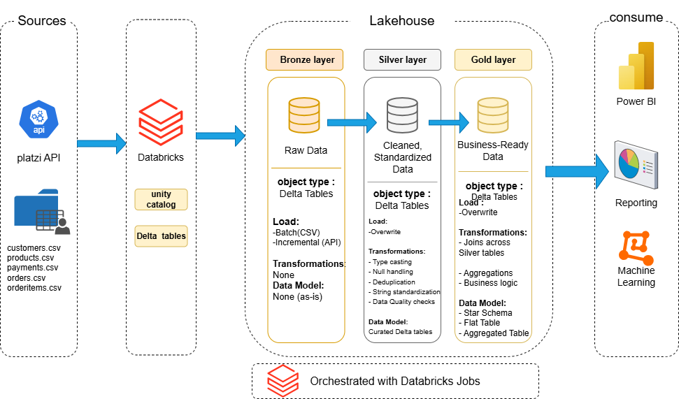
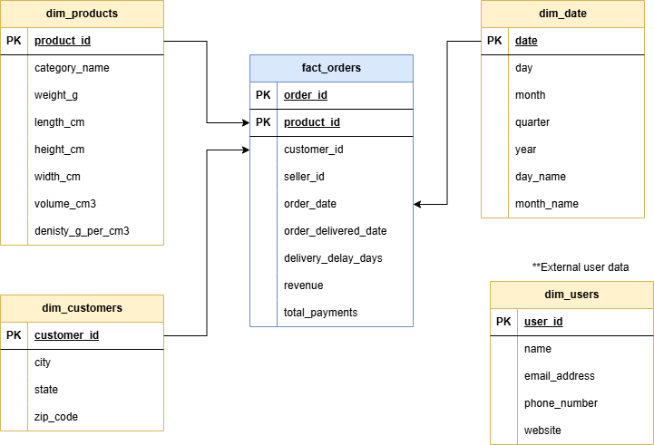
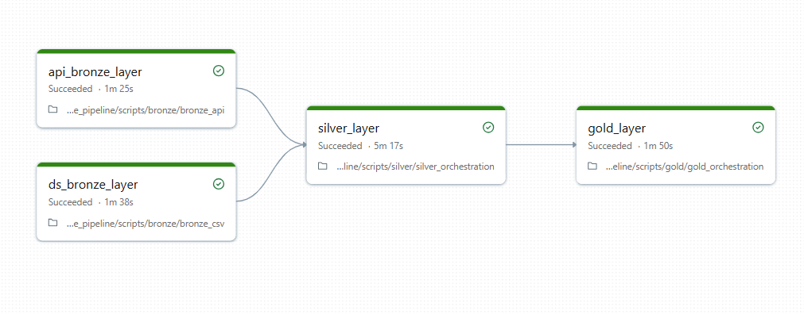

# 🛒 E-Commerce Lakehouse Pipeline

A production-style data engineering pipeline built on **Databricks** using the **Medallion Architecture** (Bronze → Silver → Gold). The pipeline ingests data from two different sources — a REST API and CSV datasets — applies transformations across 8 tables, and delivers clean, analytics-ready data in the Gold layer.

---

## 📌 Project Highlights

- **Dual-source ingestion** — pulls data from a live REST API (Platzi Fake Store) and static CSV datasets simultaneously
- **Incremental loading** — the API layer supports incremental extraction to avoid full reloads on every run
- **Reusable Silver utilities** — a shared `silver_utils` module handles schema checks, null profiling, deduplication, type casting, and data quality checks across all tables — eliminating repetitive code
- **Orchestrated pipeline** — a single orchestrator notebook per layer triggers all child notebooks sequentially, giving a clean single-node view in Databricks Workflows
- **Structured logging** — every layer uses Python `logging` with timestamps and log levels for production-grade observability
- **Delta Lake** — all layers stored as Delta tables with ACID guarantees

---

## 🏗️ Architecture



---
## 🧱 Data model



---

## 🗂️ Project Structure

```
ecommerce_lakehouse_pipeline/
│
├── scripts/
|   ├── init_lakehouse.py
|   ├── README.md
|   ├── LICENSE 
│   ├── bronze/
│   │   ├── bronze_api.py             # Ingests from Platzi Store REST API
│   │   └── bronze_csv.py             # Ingests from CSV dataset files
│   │
│   ├── silver/
│   │   ├── silver_orchestration.py   # Orchestrator — runs all 8 Silver notebooks
│   │   ├── silver_categories_api.py
│   │   ├── silver_users_api.py
│   │   ├── silver_products_api.py
│   │   ├── silver_customers_csv.py
│   │   ├── silver_orders_csv.py
│   │   ├── silver_orderitems_csv.py
│   │   ├── silver_products_csv.py
│   │   └── silver_payments_csv.py
│   │
│   ├──gold/
│   |   ├── gold_orchestration.py     # Orchestrator — runs all Gold notebooks
│   |   ├── gold_dim_customers.py
│   |   ├── gold_dim_date.py
│   |   ├── gold_dim_products.py
│   |   ├── gold_dim_users.py
│   |   └── gold_fact_orders.py
│   └── utils/
|   |     ├── silver_utils.py           # Shared utility functions 
|   |     └── __init__.py
├── docs/
|    ├── Data_architecture_ecommerce.png
|    ├── pipeline.png
|    └── model.png
├── data_sources/
|    └── README.md

```

---

## 🔄 Medallion Layers

### 🥉 Bronze — Raw Ingestion
- No transformations applied
- Data written as-is from source
- Adds metadata columns: `source`, `ingestion_time`
- Supports **incremental loading** for API source (avoids re-pulling existing records)
- Stored as Delta tables in `workspace.ecommerce_bronze`

### 🥈 Silver — Cleaned & Standardized
- Schema validation and type casting
- Null profiling and handling (drop or fill based on column rules)
- Deduplication
- String standardization
- Data Quality checks with PASS / WARN / FAIL status per column
- Adds metadata: `ingestion_date`, `pipeline_run_id`, `batch_id`, `layer`, `updated_at`
- Stored as Delta tables in `workspace.ecommerce_silver`

### 🥇 Gold — Business Ready
- Dimensional model (Star Schema)
- `gold_dim_customers`, `gold_dim_products`, `gold_dim_users`, `gold_dim_date`
- `gold_fact_orders` — central fact table joining all dimensions
- Stored as Delta tables in `workspace.ecommerce_gold`

---

## ⚙️ silver_utils — Shared Utility Module

To avoid repeating the same transformation code across 8 Silver notebooks, all common logic lives in a single shared module:

| Function | Description |
|---|---|
| `check_schema(df)` | Logs column count and schema info |
| `cast_types(df, type_map)` | Casts columns to specified types |
| `rename_col(df, old, new)` | Renames a column with logging |
| `null_profiling(df, name)` | Logs null % per column |
| `handle_nulls_drop(df, cols)` | Drops rows with nulls in specified columns |
| `handle_nulls_fill(df, rules)` | Fills nulls with defined values |
| `handle_duplicates(df, cols)` | Removes duplicates on specified subset |
| `standardize_strings(df, rules)` | Applies string transformations per column |
| `build_dq_table(spark, df, checks, name)` | Runs data quality checks and returns results DataFrame |
| `add_silver_metadata(df)` | Adds pipeline metadata columns |

---

## 📊 Data Sources

### REST API — Platzi Fake Store
- Base URL: `https://api.escuelajs.co/api/v1`
- Tables: `products`, `users`, `categories`
- Supports incremental extraction

### CSV Datasets
- Tables: `customers`, `orders`, `order_items`, `products`, `payments`
- Sourced from the Brazilian E-Commerce dataset (Olist)

---

## 🛠️ Tech Stack

| Tool | Purpose |
|---|---|
| **Databricks** | Compute, notebooks, workflows |
| **Apache Spark** | Distributed data processing |
| **Delta Lake** | Storage layer with ACID transactions |
| **Python** | Pipeline logic |
| **Databricks Workflows** | Pipeline orchestration and scheduling |
| **Unity Catalog** | Data governance and table management |

---

## 🚀 How to Run

### Prerequisites
- Databricks workspace with Unity Catalog enabled
- Cluster with DBR 13.0+ 
- Catalog `workspace` with schemas: `ecommerce_bronze`, `ecommerce_silver`, `ecommerce_gold`

### Setup
1. Clone or import the notebooks into your Databricks workspace
2. Update the notebook paths in `silver_orchestration.py` and `gold_orchestration.py` to match your workspace path
3. Create a Databricks Workflow with the following task dependency:



### Run
Trigger the workflow manually or on a schedule via Databricks Workflows UI.

---

## 📋 Pipeline Observability

All notebooks use structured Python logging:

```
2026-04-13 08:48:30 [INFO] Starting extraction — table: products, endpoint: .../products
2026-04-13 08:48:31 [INFO] API response received — 150 records for products
2026-04-13 08:48:32 [INFO] DataFrame created — 150 rows, 14 columns
2026-04-13 08:48:33 [INFO] Successfully written products to Bronze — 150 rows
```

If any notebook fails, the orchestrator logs the exact table name and error, raises an exception, and marks the Workflow task as failed immediately.

---

## 🧠 Key Design Decisions

**Why sequential execution in Free Edition?**
Databricks Community Edition has concurrency limits that make parallel notebook execution unstable. The orchestrator runs notebooks sequentially — straightforward, safe, and easy to debug. Parallel execution via Databricks Jobs API is the natural next step on a paid tier.

**Why flatten nested JSON in Bronze?**
The source API returns nested objects (e.g. `category` as a dict inside `product`). Flattening at Bronze keeps Silver notebooks simple and avoids Spark schema inference issues with deeply nested structures.

**Why a shared `silver_utils` module?**
8 Silver notebooks means 8 places where the same logic could diverge over time. Centralizing transforms in `silver_utils` ensures consistency, makes updates a one-file change, and significantly reduces notebook length.

---

## 📈 What's Next

- [ ] Migrate to parallel execution using Databricks Jobs API
- [ ] Migrate custom DQ checks to Great Expectations for standardized reporting
- [ ] Connect Gold layer to Power BI for end-to-end analytics delivery
- [ ] Implement watermark-based incremental loading for CSV sources
- [ ] Add Apache Airflow as external orchestrator for cross-platform scheduling